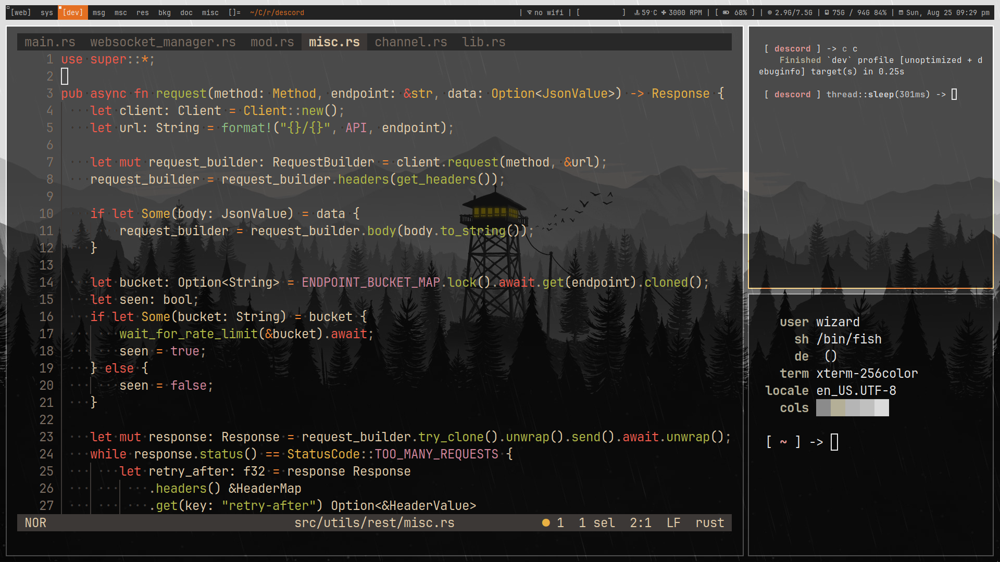

# My dotfiles

## Current dwm config
### Screenshots:

1. Terminal - alacritty
2. Text Editor - Helix
3. Fetch - [tinyfetch](https://github.com/thatmagicalcat/tinyfetch)

## Previous Hyprland config
### Screenshots:

